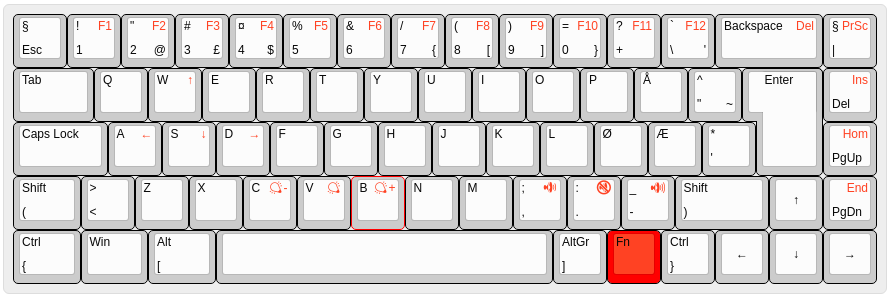

# tobiasvl's TADA68 layout for ISO-NOR

> An ISO-style layout for Norwegian keyboards.

This is [tobiasvl](https://github.com/tobiasvl)'s TADA68 layout. It is tested on a TADA68 purchased from [kbdfans](https://kbdfans.cn/) in May 2019.



### Specifics

* ISO keymap (with functioning ISO key)
* Norwegian layout
* [Grave Escape](https://docs.qmk.fm/#/feature_grave_esc)
* No mouse keys
* Some keys are moved on the function layer:
  * Home/End on Fn+PgUp/PgDn
  * Insert on Fn+Delete
  * Delete on Fn+Backspace
  * PrintScreen on Fn+|
* [Space Cadet](https://docs.qmk.fm/#/feature_space_cadet) features:
  * [Command](https://docs.qmk.fm/#/feature_command) is turned off
  * Tapping left and right Shift: Parentheses
  * Tapping left and right CTRL: Curly braces
  * Tapping left and right Alt: Brackets

## Building

```
make tada68:tobiasvl:flashbin
```
